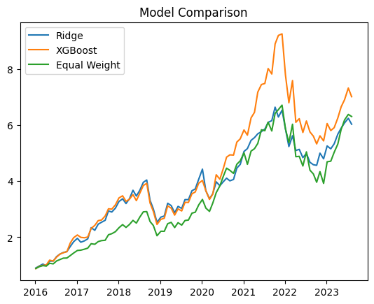

# Machine Learning–Driven Portfolio Allocation Under Estimation Risk

## Overview

This project implements a rolling, forecast-driven portfolio allocation framework integrating:

- Machine learning return prediction (Ridge & XGBoost)
- Shrinkage-based covariance estimation
- Constrained mean–variance optimisation
- Turnover-aware transaction cost modelling
- Out-of-sample rolling backtesting

The objective is to evaluate whether ML-based return forecasts improve risk-adjusted performance relative to a naïve equal-weight benchmark, while explicitly accounting for estimation error and trading frictions.

The project emphasises robustness, constraint realism, and the interaction between forecasting and portfolio construction.

---

## System Architecture

Market Data
↓
Feature Engineering
↓
Return Forecasting (Ridge / XGBoost)
↓
Shrinkage Covariance Estimation
↓
Constrained Mean–Variance Optimisation
↓
Transaction Cost Adjustment
↓
Rolling Out-of-Sample Evaluation

---

## Asset Universe

AAPL
MSFT
NVDA
JPM
AMZN

---

## Prediction Layer

- Target: 21-day forward cumulative return  
- Rolling training window: 252 trading days  
- Rebalancing frequency: every 21 days  

Models used:

- **Ridge Regression** (L2-regularised linear model)
- **XGBoost** (Gradient Boosted Trees)

Features include momentum and volatility indicators derived from rolling return statistics.

---

## Portfolio Construction

Portfolio weights are obtained by solving a constrained mean–variance optimisation problem.

**Objective**

$$
\max_w \; w^T \hat{\mu} - \lambda w^T \Sigma w
$$

**Subject to**

- Fully invested: $\sum_i w_i = 1$
- Long-only: $w_i \ge 0$
- Maximum 50% allocation per asset

Where:

- $\hat{\mu}$ = predicted returns  
- $\Sigma$ = Ledoit–Wolf covariance matrix  
- $\lambda$ = risk aversion parameter  

---

### Transaction Costs

$$
\text{Cost} = c \sum_i |w_{t,i} - w_{t-1,i}|
$$

---

## Risk Estimation

To reduce instability in covariance estimation, the Ledoit–Wolf shrinkage estimator is used instead of the raw sample covariance matrix.

This improves optimisation stability across different risk-aversion settings.

---

## Evaluation Metrics

Out-of-sample performance is evaluated using:

- Annualised return  
- Annualised volatility  
- Sharpe ratio  
- Maximum drawdown  

Performance is compared against an equal-weight benchmark.

## Performance Overview

---

## Key Findings

- Equal-weight allocation remains competitive in small asset universes.
- Portfolio construction has greater impact than model complexity.
- Transaction costs materially reduce realised performance.
- Covariance shrinkage improves optimisation robustness.

---

## Limitations

- Small asset universe  
- Limited feature set  
- No macroeconomic predictors  
- No cross-validation for hyperparameter tuning  

---

## Possible Extensions

- Expanded asset universe  
- Regime-dependent modelling  
- Robust optimisation approaches  
- Factor-based feature enrichment  
- Enhanced transaction cost modelling  

---

## Technologies Used

- Python  
- NumPy  
- Pandas  
- Scikit-learn  
- XGBoost  
- CVXPY  
- yfinance  
- Matplotlib  

---

## How to Run

1. Install dependencies:
   pip install -r requirements.txt

2. Run the notebook:
   portfolio_engine_final.ipynb
   
---

## Disclaimer

This project is for research and educational purposes only and does not constitute investment advice.
